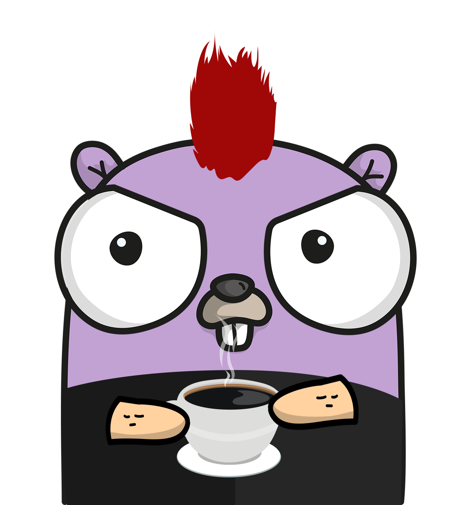

# Grocery-Helper

This application is to help keep track of what you need at the grocery store:

## Ideas

1. Simple list
2. Meal descriptions
3. Meal ingredients into full list (can add multiple meals 1 total list)

## Tools used initially

1. Docker for all containers/runtime
2. Golang backend
3. Tailwind CSS
4. Htmx frontend
5. Redis worker if needed

GoTH stack


## Tools to use once launching

1. Gitlab CI for testing/changes after feature 1 included
2. Kubernetes deployment (openshift maybe?)
3. Argo CD
4. Terraform
5. AWS

## Process

1. Build API
2. Async processing for distributed layers
3. Save to Database

## Run Locally

``` bash
./z_env_scripts/build-images.sh && docker compose up -d
```
